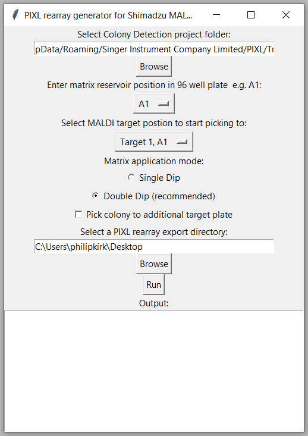

# PIXL Rearray Generator for the Shimadzu MALDI-TOF microbial ID workflow

This python program generates a PIXL 'rearray file' for a Shimadzu MALDI-TOF microbial ID workflow.

Users are presented with a GUI which allows them to select a Colony Detection folder
produced by PIXL and select workflow options such as starting position on the target,
matrix location on a multiwell plate and whether they would also wish to pin to a separate
multiwell plate for downstream culturing or other uses.

The application exports a rearray file to the users chosen directory for use with PIXL's Rearray mode.

## For Users
### Usage

Please follow the following [link for a detailed protocol](https://singer-instruments.fibery.io/Science/White_Papers_and_application_notes/Preparing-Shimadzu-MALDI-ToF-targets-with-PIXL-for-microbial-identification-Method-1---Using-the-Shi-2?sharing-key=af833114-8cd2-4562-a0ea-2791ca9cb624) on how to prepare Shimadzu MALDI-TOF targets using PIXL.

## For Developers

### Implementation

The purpose of this app is to generate 'rearray files' for PIXL which
can be used to instruct PIXL to prepare MALDI-ToF target plates (Shimadzu).
Rearray files are PIXL and human readable comma/tab seperated files (CSVs/TSVs)
that instruct PIXL how to operate. For more information about rearray files,
please consult [PIXL Rearray guide.pdf](/docs/PIXL Rearray guide.pdf).

The application utilizes TKinter as the GUI framework. Users are prompted to
input the location of their Colony Detection project directory and specify
settings for generating the rearray file according to their preferences.
To enhance usability, user defined settings are persistently stored in a
configuration file (`config.txt` stored in Appdata) which will be
used to prepopulate the GUI in future sessions.

When the user clicks the "Run" button, the
`run()` function is invoked. This function orchestrates various
steps in generating the rearray file. First, the
function invokes the `read_stub_tsv()` method, which retrieves the rearray 'stub'
file from the Colony Detection directory and converts it into a `pandas` dataframe.
Subsequently, the dataframe is passed to the `export_pixl_array()` function,
responsible for coordinating the construction of the PIXL rearray file based on
the user-defined settings. Within this function, several key operations are
performed in a sequential manner. First, the `prepare_pixl_array()` method is
called to contruct a blank dataframe that will become the PIXL rearray and
append plate definitions. Next, the `append_pixl_commands_to_array()`
function adds colony transfer and matrix application commands to the rearray
dataframe.

If the user specifies the requirement to pick to an additional
plate, the `append_additional_target_to_array()` method is invoked to append
the corresponding commands in the rearray file. Finally, upon completion of the
rearray file generation process,
the `export_pixl_array()` function exports the resulting PIXL array file to the
user-defined destination folder and the user is informed in a text box in the
GUI.

[![](https://mermaid.ink/img/eyJjb2RlIjoiZ3JhcGggVERcbkEoKFN0YXJ0KSlcbkEgLS0-IEIoVXNlciBpbnB1dCBpbiBHVUkpXG5CIC0tPiBDW0NvbmZpZ3VyYXRpb24gRmlsZV1cbkMgLS0-IEJcbkIgLS0-IERbUnVuIEJ1dHRvbl1cbkQgLS0-IEYoXCJydW4oKVwiKVxuRiAtLT4gRXtWYWxpZCBJbnB1dD99XG5FIC0tIFllcyAtLT4gRyhcIlJlYWRfU3R1Yl9UU1YoKVwiKVxuXG5IW0NvbG9ueSBEZXRlY3Rpb24gZGlyZWN0b3J5XSAtLT4gR1xuRyAtLT4gSVsoc3R1YiBEYXRhRnJhbWUpXVxuSSAtLT4gSihcImV4cG9ydF9waXhsX2FycmF5KClcIilcbkogLS0-IEsoXCJwcmVwYXJlX3BpeGxfYXJyYXkoKVwiKVxuSyAtLSBQbGF0ZSBEZWZpbml0aW9ucyBhcHBlbmRlZCAtLT5VWyhSZWFycmF5IERhdGFGcmFtZSldXG5VIC0tPiBQQ1tcImFwcGVuZF9waXhsX2NvbW1hbmRzX3RvX2FycmF5KClcIl1cblVEM1tVc2VyLWRlZmluZWQgU2V0dGluZ3NdIC0tPiBQQ1xuUEMgLS0gQ29sb255IGFuZCBtYXRyaXggdHJhbnNmZXIgY29tbWFuZHMgYXBwZW5kZWQtLT5VMlsoUmVhcnJheSBEYXRhRnJhbWUpXVxuVTIgLS0-IFB7QWRkaXRpb25hbCBQbGF0ZT99XG5VRDJbVXNlci1kZWZpbmVkIFNldHRpbmdzXSAtLT4gUHtBZGRpdGlvbmFsIFBsYXRlP31cblAgLS0gWWVzIC0tPiBRW1wiYXBwZW5kX2FkZGl0aW9uYWxfdGFyZ2V0X3RvX2FycmF5KClcIl1cblEgLS0gQWRkaXRpb24gY29sb255IHRyYW5zZmVyIGNvbW1hbmRzIGFwcGVuZGVkIC0tPiBVM1soUmVhcnJheSBEYXRhRnJhbWUpXVxuUCAtLSBObyAtLT4gU1tFeHBvcnQgUElYTCBhcnJheV1cblUzIC0tPiBTXG5TIC0tPiBUKChFbmQpKSIsIm1lcm1haWQiOnsidGhlbWUiOiJkZWZhdWx0In0sInVwZGF0ZUVkaXRvciI6ZmFsc2V9)](https://mermaid-js.github.io/docs/mermaid-live-editor-beta/#/edit/eyJjb2RlIjoiZ3JhcGggVERcbkEoKFN0YXJ0KSlcbkEgLS0-IEIoVXNlciBpbnB1dCBpbiBHVUkpXG5CIC0tPiBDW0NvbmZpZ3VyYXRpb24gRmlsZV1cbkMgLS0-IEJcbkIgLS0-IERbUnVuIEJ1dHRvbl1cbkQgLS0-IEYoXCJydW4oKVwiKVxuRiAtLT4gRXtWYWxpZCBJbnB1dD99XG5FIC0tIFllcyAtLT4gRyhcIlJlYWRfU3R1Yl9UU1YoKVwiKVxuXG5IW0NvbG9ueSBEZXRlY3Rpb24gZGlyZWN0b3J5XSAtLT4gR1xuRyAtLT4gSVsoc3R1YiBEYXRhRnJhbWUpXVxuSSAtLT4gSihcImV4cG9ydF9waXhsX2FycmF5KClcIilcbkogLS0-IEsoXCJwcmVwYXJlX3BpeGxfYXJyYXkoKVwiKVxuSyAtLSBQbGF0ZSBEZWZpbml0aW9ucyBhcHBlbmRlZCAtLT5VWyhSZWFycmF5IERhdGFGcmFtZSldXG5VIC0tPiBQQ1tcImFwcGVuZF9waXhsX2NvbW1hbmRzX3RvX2FycmF5KClcIl1cblVEM1tVc2VyLWRlZmluZWQgU2V0dGluZ3NdIC0tPiBQQ1xuUEMgLS0gQ29sb255IGFuZCBtYXRyaXggdHJhbnNmZXIgY29tbWFuZHMgYXBwZW5kZWQtLT5VMlsoUmVhcnJheSBEYXRhRnJhbWUpXVxuVTIgLS0-IFB7QWRkaXRpb25hbCBQbGF0ZT99XG5VRDJbVXNlci1kZWZpbmVkIFNldHRpbmdzXSAtLT4gUHtBZGRpdGlvbmFsIFBsYXRlP31cblAgLS0gWWVzIC0tPiBRW1wiYXBwZW5kX2FkZGl0aW9uYWxfdGFyZ2V0X3RvX2FycmF5KClcIl1cblEgLS0gQWRkaXRpb24gY29sb255IHRyYW5zZmVyIGNvbW1hbmRzIGFwcGVuZGVkIC0tPiBVM1soUmVhcnJheSBEYXRhRnJhbWUpXVxuUCAtLSBObyAtLT4gU1tFeHBvcnQgUElYTCBhcnJheV1cblUzIC0tPiBTXG5TIC0tPiBUKChFbmQpKSIsIm1lcm1haWQiOnsidGhlbWUiOiJkZWZhdWx0In0sInVwZGF0ZUVkaXRvciI6ZmFsc2V9)

### Prerequisites to run in developer environment

- Python 3.6 or higher
- pandas
- tkinter

### Updating the flowchart in this README

The flowchart was constructed using [mermaid-js.github.io](https://mermaid-js.github.io/docs/mermaid-live-editor-beta/#/edit/eyJjb2RlIjoiZ3JhcGggVERcbkEoKFN0YXJ0KSlcbkEgLS0-IEIoVXNlciBpbnB1dCBpbiBHVUkpXG5CIC0tPiBDW0NvbmZpZ3VyYXRpb24gRmlsZV1cbkMgLS0-IEJcbkIgLS0-IERbUnVuIEJ1dHRvbl1cbkQgLS0-IEYoXCJydW4oKVwiKVxuRiAtLT4gRXtWYWxpZCBJbnB1dD99XG5FIC0tIFllcyAtLT4gRyhcIlJlYWRfU3R1Yl9UU1YoKVwiKVxuXG5IW0NvbG9ueSBEZXRlY3Rpb24gZGlyZWN0b3J5XSAtLT4gR1xuRyAtLT4gSVsoc3R1YiBEYXRhRnJhbWUpXVxuSSAtLT4gSihcImV4cG9ydF9waXhsX2FycmF5KClcIilcbkogLS0-IEsoXCJwcmVwYXJlX3BpeGxfYXJyYXkoKVwiKVxuSyAtLSBQbGF0ZSBEZWZpbml0aW9ucyBhcHBlbmRlZCAtLT5VWyhSZWFycmF5IERhdGFGcmFtZSldXG5VIC0tPiBQQ1tcImFwcGVuZF9waXhsX2NvbW1hbmRzX3RvX2FycmF5KClcIl1cblVEM1tVc2VyLWRlZmluZWQgU2V0dGluZ3NdIC0tPiBQQ1xuUEMgLS0gQ29sb255IGFuZCBtYXRyaXggdHJhbnNmZXIgY29tbWFuZHMgYXBwZW5kZWQtLT5VMlsoUmVhcnJheSBEYXRhRnJhbWUpXVxuVTIgLS0-IFB7QWRkaXRpb25hbCBQbGF0ZT99XG5VRDJbVXNlci1kZWZpbmVkIFNldHRpbmdzXSAtLT4gUHtBZGRpdGlvbmFsIFBsYXRlP31cblAgLS0gWWVzIC0tPiBRW1wiYXBwZW5kX2FkZGl0aW9uYWxfdGFyZ2V0X3RvX2FycmF5KClcIl1cblEgLS0gQWRkaXRpb24gY29sb255IHRyYW5zZmVyIGNvbW1hbmRzIGFwcGVuZGVkIC0tPiBVM1soUmVhcnJheSBEYXRhRnJhbWUpXVxuUCAtLSBObyAtLT4gU1tFeHBvcnQgUElYTCBhcnJheV1cblUzIC0tPiBTXG5TIC0tPiBUKChFbmQpKSIsIm1lcm1haWQiOnsidGhlbWUiOiJkZWZhdWx0In0sInVwZGF0ZUVkaXRvciI6ZmFsc2V9)

The mermaid.js code to construct it is stored in docs/mermaid.js/flowchart.txt

### Distribution

This application is intended to be shared with users in a 'frozen' executable.
This avoids users having to install python, worry about dependences and enables them to interact with the
application in a familiar way. The script `shimadzu-rearray-generator.py` can still
be ran within a development environment if required.

The distribution is constructed using `pyinstaller`. It is worth familiarising
yourself with this module.

A distribution is created within CMD:

1. Install pyinstaller: `pip install pyinstaller'
2. Change directory to repository directory
3. [`edit file_version_info.txt` with version number etc]
4. Run `pyinstaller shimadzu-rearray-generator.py --add-data "shimadzu_adapter_coordinates_Precision_adapter.csv;." --add-data "MALDITOF-PINNING-PROFILE.xml;." --add-data "shimadzu_adapter_coordinates_SI_adapter.csv;." --add-data "thermo_nunc_96_coordinates.csv;." --add-data "icon.ico;." --version-file file_version_info.txt --icon icon.ico
`
5. The `.spec` file defines, amongst other things, what other files are bundled with the distribution.
6. A `dist` directory will be produced that can be deployed to customers.

